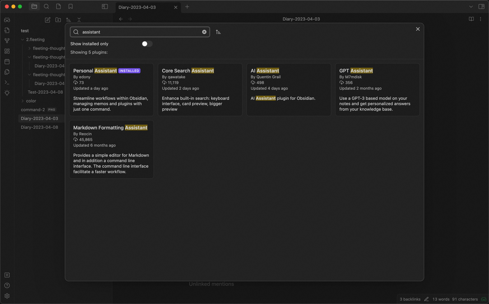

# Obsidian Personal Assistant

    An Obsidian plugin which help you to automatically manage Obsidian.
     
    <a href="/README_cn.md">简体中文</a>
    ·
    <a href="/README.md">English</a>
     
    
    

> ***号外***: 新特性来啦！支持自动更新笔记中 frontmatter 的元数据。

> ***Update Plugins and Themes***

> ***使用示例***

## 功能特性
> ***注意***: 当前支持的特性都是出于我个人使用 Obsdiain 的需求，欢迎提交你们期望的功能特性需求。

1. 在指定目录自动创建 note，note 名称可以格式化配置方便管理
2. 自动打开当前 note 的关系视图
3. 像 macOS 的快速备忘录一样使用 Memos 做记录
4. 在命令面板中快速开关插件
5. 自动更新插件
6. 自动更新主题
7. 自动设置关系视图的颜色

## 研发

请参考[这里](./DEVELOPEMENT.md).

## 安装

插件已经在[插件市场](https://obsidian.md/plugins?search=personal%20assistant#)上架了，现在你可以直接在 Obsidian 应用程序中安装这个插件，请查看[手册](https://help.obsidian.md/Extending+Obsidian/Community+plugins#Install+a+community+plugin)获取更多详细信息。

### 通过 BRAT 安装

- 在 Obsidian 中安装 BRAT 插件；
- 打开命令面板输入 BRAT 命令：`Add a beta plugin for testing`；
- 将字符串 `https://github.com/edonyzpc/personal-assistant` 拷贝到对话框中；
- 点击添加插件，等待 BRAT 自动下载插件文件；
- BRAT 提示安装完成之后在设置的插件页面查找安装号的插件；
- 刷新插件列表找到安装的插件；
- 使能该插件；

### 手动安装

- 通过源码编译: `yarn install && yarn build` 或者直接从 [release page](https://github.com/edonyzpc/personal-assistant/releases) 下载
- 将这些文件 `main.js`, `styles.css`, `manifest.json` 拷贝到 Obsidian 的插件目录 `{VaultFolder}/.obsidian/plugins/perosonal-assistant/`.

## 使用

### 1. 在指定目录自动创建 note
- 打开命令面板找到对应的命令

- note 自动创建并打开，此时可以直接开始你的记录了
- 【***推荐***】使用 [Templater](https://github.com/SilentVoid13/Templater) 插件的 `Folder Templates` 配置 note 模版，从而实现目录级别的模版自定义
### 2. 在 hover 打开 memos
- 打开命令面板找到对应的命令

- 开始你的 memos 之旅
### 3. 打开当前笔记的关系图
- 打开命令面板找到对应的命令

- 插件的设置中有更多设置选项，包括深度、展示标签等
- 查看包括 backlink 和 outgoing-link 关系图
### 4. 开关插件
- 打开命令面板找到对应的命令

- 选择你要开关的插件，该命令支持根据插件名检索
- 【***注意***】插件选择界面中，插件名前面绿色的 checkbox 代表插件已经打开，红色的 uncheckbox 代表插件已经关闭
### 5. 更新插件
- 打开命令面板找到对应的命令

- 触发该命令
- 在右上角的通知窗口查看插件更新状态